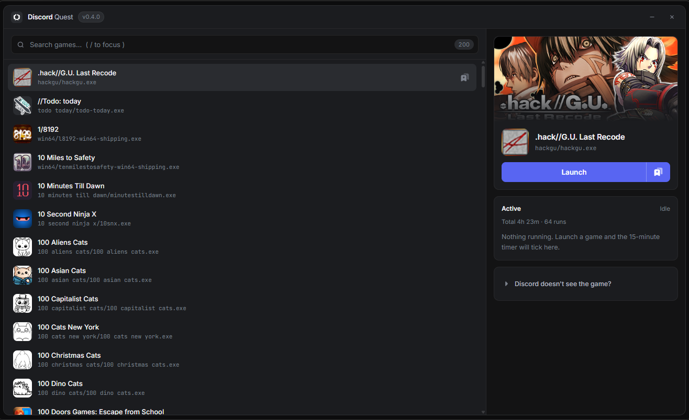

# Discord Quest

A Windows app that completes Discord "play a game" quests for you. Pick a game
from the catalog, hit Launch, wait for the 15:00 timer, claim the reward.
No installs, no client patching.



## What it covers

| Quest type | Works | Notes |
| --- | --- | --- |
| Play a game for 15 minutes | Yes | the core feature: a fake process with the quest game's exe name |
| Play 2/3 different games | Yes | launch several fakes at once, timers run in parallel |
| Play a specific quest game | Yes | search it by name, launch its fake |
| Watch-a-video / click quests | n/a | just click them in the Quests tab, no fake needed |
| Achievement / in-game progress | No | the client checks real game telemetry, a fake process can't provide it |

While a fake is running, Discord sees the game as detected and its server-side
timer accumulates. The app mirrors the 15:00 progress per session in the
Active panel, so you know exactly when to claim.

## Download and install

Grab `Quest.Rig_0.4.0_x64-setup.exe` from
[Releases](../../releases) (built automatically by CI on every `v*` tag) and run
it. Standard installer with desktop/start-menu shortcuts and an
English/Russian language selector. WebView2 gets installed automatically if
it is missing.

The installers are not code-signed, so Windows SmartScreen shows
"Windows protected your PC" on first launch. That is expected for any
unsigned build. More info, then Run anyway. Everything is built by GitHub
Actions straight from the tagged source.

Building from source:

```bat
git clone <repo>
cd "Discord Quest"
npm install
dev.bat              :: dev mode with hot reload
npm run tauri build  :: installer + portable exe in src-tauri\target\release\bundle
```

Requires Node 18+ and the Rust toolchain (MSVC target).

## How it works

1. Loads the detectable-games catalog from
   `discord.com/api/v9/applications/detectable` (directly from the window,
   falling back to the Rust backend with a cache).
2. Copies a tiny GUI host (`game_host.exe`, about 130 KB, our own binary)
   under the real game's executable name, e.g. `SonsOfTheForest.exe`, into
   `%LOCALAPPDATA%\DiscordQuest\games\`.
3. Launches it as a normal process with a real (but off-screen) window titled
   after the game.
4. Discord's process scanner sees a "running game" and the quest timer ticks.

Sessions are persisted to `%LOCALAPPDATA%\DiscordQuest\sessions.json`:

- processes still alive after an app restart are adopted with their timers
  intact (verified by PID plus image path),
- processes that died end up under Paused: hit Resume and the timer continues
  where it stopped,
- total farmed time and run count are kept in the Total counter.

## The game is not detected

- In Discord go to Settings, Privacy Settings, and turn on "Share detected
  activity". Without it, detection is shown to no one, including you.
- Detection is not instant: the scanner polls processes roughly every
  15 to 30 seconds.

## Controls

- `/` focuses search, up/down moves selection, `Enter` launches, `Esc` clears.
- Double-click a row to launch. The bookmark icon pins a game to the top.
  Pinned games are hidden from search results while a query is typed.
- The same game cannot be launched twice. A running game shows a Running state.
- `X` on a session stops the process and deletes the fake exe.

## Project notes

- `scripts/ensure-host.mjs` compiles `game_host.exe` (a separate workspace
  crate, `src-tauri/game-host/`) and stages it into `src-tauri/binaries/`.
  Tauri validates the bundle resource on every cargo invocation.
- `scripts/tauri.mjs` wraps the Tauri CLI: it stages the window icon into
  `%LOCALAPPDATA%\DiscordQuest\` and overrides `bundle.icon` via
  `TAURI_CONFIG`, because tauri-winres mangles build paths containing
  apostrophes (e.g. `C:\Project's\...` gives RC2135).
- `scripts/png-to-ico.mjs` builds the multi-size `icon.ico` from a source PNG
  (`src/icon.png`).
- `scripts/make-banner.ps1` renders `docs/banner.png`.
- `game_host` is a separate crate so it can be built without triggering
  Tauri's build script (which validates bundle resources).

## Disclaimer

Educational tool. This targets a specific chat client's quest system and
violates its ToS. Use at your own risk.
Licensed under [MIT](LICENSE).
